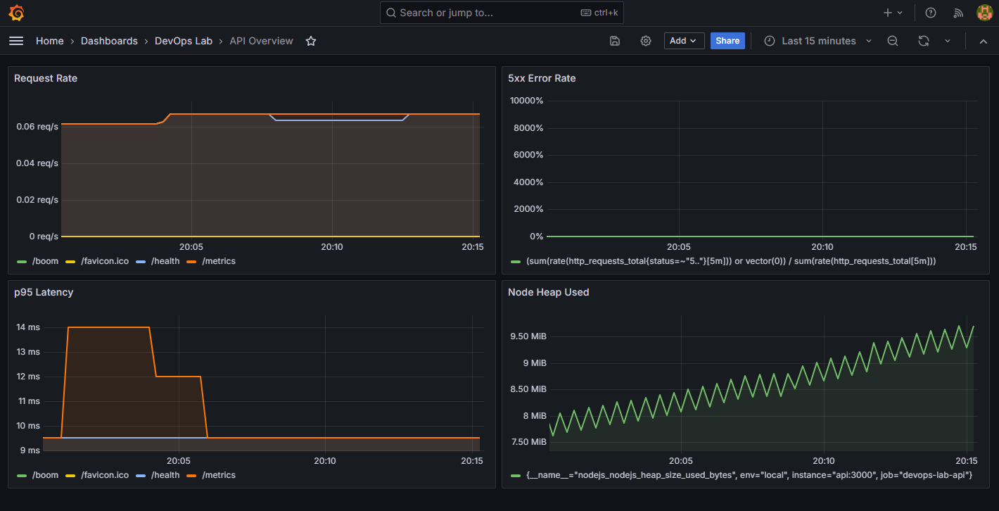

# Devops-lab-pipeline

A containerized Node.js REST API with Docker Compose, Prometheus metrics, and Grafana dashboards - the entire stack runs locally with one command.



## Overview

A small DevOps project that demonstrates four foundational layers of a modern deployment stack:

1. A Node.js API with health, readiness, and Prometheus metrics endpoints
2. Automated tests with Jest + Supertest
3. A multi-stage Dockerfile running as a non-root user with a healthcheck
4. A Docker Compose stack running the API alongside Prometheus and Grafana

Everything runs on your machine. No cloud account required.

## Stack

| Layer | Tool |
|---|---|
| App | Node.js 20 + Express |
| Tests | Jest + Supertest |
| Container | Docker (multi-stage, Alpine) |
| Orchestration | Docker Compose |
| Metrics | Prometheus |
| Dashboards | Grafana |

## Quickstart

Prerequisites: Docker Desktop (or Docker Engine + Compose plugin).

```bash
git clone https://github.com/rajanshah23/devops-lab-pipeline.git
cd devops-lab-pipeline
docker compose up -d --build
```

Wait about 15 seconds, then open:

- **API:** http://localhost:3000
- **Prometheus:** http://localhost:9090
- **Grafana:** http://localhost:3001
- **Dashboard:** Grafana -> Dashboards -> DevOps Lab -> API Overview

To stop everything:

```bash
docker compose down
```

To also delete stored metrics and Grafana data:

```bash
docker compose down -v
```

## API endpoints

| Method | Path | Description |
|---|---|---|
| GET | `/` | Lists available endpoints |
| GET | `/health` | Liveness check |
| GET | `/ready` | Readiness check |
| GET | `/metrics` | Prometheus metrics |
| GET | `/api/tasks` | List all tasks |
| POST | `/api/tasks` | Create a task - body: `{ "title": "..." }` |
| DELETE | `/api/tasks/:id` | Delete a task |
| GET | `/boom` | Returns 500 - used to demo the error-rate panel |

## Architecture

```
+------------+    scrape /metrics    +--------------+
|    api     | ------------------->  |  prometheus  |
|   :3000    |                       |    :9090     |
+-----+------+                       +------+-------+
      |                                     |
      |  user opens in browser              |  query
      v                                     v
+------------+                       +--------------+
|  browser   | <---- dashboard ----  |   grafana    |
+------------+                       |    :3001     |
                                     +--------------+
```

All three services run on the same Docker network (`lab`) and find each other by service name (`api`, `prometheus`, `grafana`).

## Project structure

```
devops-lab-pipeline/
|-- src/
|   |-- app.js                 # Express app + Prometheus instrumentation
|   +-- server.js              # Entry point with graceful shutdown
|-- tests/
|   +-- app.test.js            # Jest + Supertest tests
|-- monitoring/
|   |-- prometheus/
|   |   +-- prometheus.yml     # Scrape configuration
|   +-- grafana/provisioning/
|       |-- datasources/       # Auto-configured Prometheus datasource
|       +-- dashboards/        # Auto-provisioned API Overview dashboard
|-- docs/
|   +-- dashboard.png          # Screenshot of the API Overview dashboard
|-- Dockerfile                 # Multi-stage build, non-root runtime
|-- docker-compose.yml         # api + prometheus + grafana
|-- .dockerignore
|-- .gitignore
|-- eslint.config.js
|-- package.json
|-- package-lock.json
+-- README.md
```

## How it works

### The Dockerfile

Multi-stage build:

- **Stage 1 (`deps`)** - installs production dependencies with `npm ci --omit=dev`
- **Stage 2 (`runtime`)** - copies only what's needed, creates a non-root user (UID 10001), sets a healthcheck, and runs the app via exec-form `CMD` so signals reach Node - required for graceful shutdown.

### The metrics

`src/app.js` instruments every request with:

- `http_requests_total` - counter labeled by method, route, status
- `http_request_duration_seconds` - histogram used to compute p95 latency

Plus Node.js default metrics (memory, CPU, event loop lag) via `prom-client`.

### The Compose stack

- `api` - builds from the local Dockerfile, healthcheck gated
- `prometheus` - starts after `api` is healthy, scrapes `/metrics` every 15s
- `grafana` - starts after Prometheus, auto-loads datasource + dashboard from provisioning files

### The dashboard

Four panels, all provisioned from `monitoring/grafana/provisioning/dashboards/api-overview.json`:

| Panel | Query | Unit |
|---|---|---|
| **Request Rate** | `sum(rate(http_requests_total[5m])) by (route)` | req/s |
| **5xx Error Rate** | ratio of 5xx to total responses | percent |
| **p95 Latency** | `histogram_quantile(0.95, sum(rate(http_request_duration_seconds_bucket[5m])) by (le, route))` | seconds |
| **Node Heap Used** | `nodejs_nodejs_heap_size_used_bytes` | bytes |

## Generating traffic to see the dashboard

In a second terminal:

```bash
for i in $(seq 1 300); do
  curl -s -o /dev/null http://localhost:3000/api/tasks
  curl -s -o /dev/null -X POST http://localhost:3000/api/tasks \
    -H 'Content-Type: application/json' -d "{\"title\":\"task $i\"}"
done
```

Windows PowerShell equivalent:

```powershell
1..300 | ForEach-Object {
  curl.exe -s -o NUL http://localhost:3000/api/tasks
  curl.exe -s -o NUL -X POST http://localhost:3000/api/tasks `
    -H "Content-Type: application/json" `
    -d '{"title":"task '$_'"}'
}
```

To make the error-rate panel spike:

```powershell
1..30 | ForEach-Object { curl.exe -s -o NUL http://localhost:3000/boom }
```

Wait 15 seconds (one scrape interval) and refresh Grafana.

## Running tests locally

```bash
npm install
npm test
npm run lint
```

Coverage is written to `coverage/lcov-report/index.html`.

## Troubleshooting

**Port 3000 already in use**
Stop the other service, or edit `docker-compose.yml` and change `"3000:3000"` to `"3001:3000"`.

**Prometheus target shows DOWN**
Wait 15 seconds for the first scrape. If still down, check `docker compose logs prometheus`.

**Grafana shows "No data" in panels**
No traffic yet. Run the traffic loop above, then wait 15 seconds.

**Container marked unhealthy**
Run `docker compose logs api` to see why.

## What I learned

- Multi-stage Docker builds keep the runtime image small and free of dev dependencies
- Exec-form `CMD` is required for graceful shutdown in containers - a shell-form `CMD` intercepts `SIGTERM` and breaks zero-downtime deploys
- Prometheus discovers scrape targets by Docker service name on a shared network
- Grafana dashboards can be provisioned from files instead of clicked together, which makes them portable and version-controlled
- Counters must be wrapped in `rate()` before they mean anything - a raw counter only goes up

